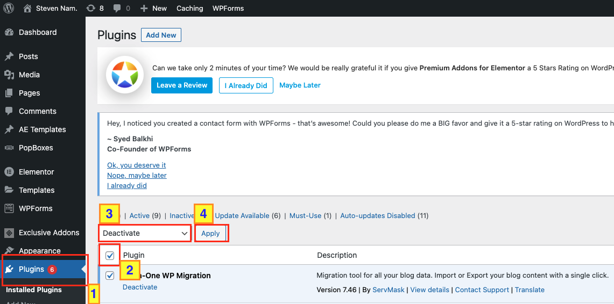

<!-- PROJECT LOGO -->
 

  

  <h3 align="center">Build Your Resume Website with WordPress</h3>

  

    Build your website without coding and make your skills and experience more visible!
     
    <a href="https://github.com/seyoungnam/resume_website_with_wordpress"><strong>Explore the docs »</strong></a>
     
     
    <a href="https://https://smartandsecurecomputing.org/stevennam/">View Demo</a>
    ·
    <a href="https://github.com/seyoungnam/resume_website_with_wordpress/issues">Report Bug</a>
    ·
    <a href="https://github.com/seyoungnam/resume_website_with_wordpress/issues">Request Feature</a>
  

<!-- TABLE OF CONTENTS -->

  
Table of Contents

  <ol>
    <li>
      <a href="#about-the-project">About The Project</a>
      <ul>
        <li><a href="#built-with">Built With</a></li>
      </ul>
    </li>
    <li>
      <a href="#getting-started">Getting Started</a>
      <ul>
        <li><a href="#prerequisites">Prerequisites</a></li>
      </ul>
    </li>
    <li>Template Selection</li>
    <li><a href="#designing">Designing</a></li>
    <li><a href="#contributing">Contributing</a></li>
    <li><a href="#contact">Contact</a></li>
    <li><a href="#acknowledgements">Acknowledgements</a></li>
  </ol>

<!-- ABOUT THE PROJECT -->
## About The Project

[![Product Name Screen Shot][product-screenshot]](https://example.com)

There are many great README templates available on GitHub, however, I didn't find one that really suit my needs so I created this enhanced one. I want to create a README template so amazing that it'll be the last one you ever need -- I think this is it.

Here's why:
* Your time should be focused on creating something amazing. A project that solves a problem and helps others
* You shouldn't be doing the same tasks over and over like creating a README from scratch
* You should implement DRY principles to the rest of your life :smile:

Of course, no one template will serve all projects since your needs may be different. So I'll be adding more in the near future. You may also suggest changes by forking this repo and creating a pull request or opening an issue. Thanks to all the people have contributed to expanding this template!

A list of commonly used resources that I find helpful are listed in the acknowledgements.

### Built With

This section should list any major frameworks that you built your project using. Leave any add-ons/plugins for the acknowledgements section. Here are a few examples.
* [WordPress](https://getbootstrap.com)
* [JQuery](https://jquery.com)
* [Laravel](https://laravel.com)

<!-- GETTING STARTED -->
## Getting Started

To set up the working environment, please watch and follow <a href="https://www.youtube.com/watch?v=VnjeR-bsRM4" target="_blank">Tyler's YouTube video</a> by 21:20. It will teach you every basic technic you need to implement.

### Prerequisites

There are no explicit prerequisites for this project. One thing to keep in mind is that you have to buy your domain name and a web hosting service, which will cause you to pay some amount of money. In the Tyler's video, he has decided to use <a href="https://hostgator.com" target="_blank">HostGator</a> for the web hosting. Although you don't necessarily follow his recommendation, you better stick to it because this tutorial is written based on the HostGator's WordPress configuration.

<!-- Template Selection -->
## Template Selection

1. Clean all Plugins out.

 

2. Visit your site to confirm your site is empty.

 

3. Back into the dashboard and go to “**Settings**” and “**Permalinks**”. Make sure to choose “**Post name**” as the URL and click “**save changes**”.

 

4. To make sure your website is discoverable by the search engines. Go to “**Reading**” in the settings, make sure “**Search engine visibility**” part is not checked. And click “**save changes**”.

 

5. Install the theme. 

    * Go to “**Appearance**” and click on “**Themes**”.
    
    * Click “**Add New**” button.
    
    * In the search bar, type “Astra”, and click on **install**, and **activate** on Astra theme.
    

 

6. Install plugins for template.

    * Click “**Plugins**” -> “**Add New**” -> type “**Starter templates**” in search bar, then click “**Install**” and “**activate**” on Starter Templates - Elementor.
    
    
    * Click “**Apperance**” -> “**Starter Templates**”. Choose Elementor
    
    
    * In the search box, type and click “**Learn Digital Marketing**”
    
    * Click “**Import Complete Site**”
    