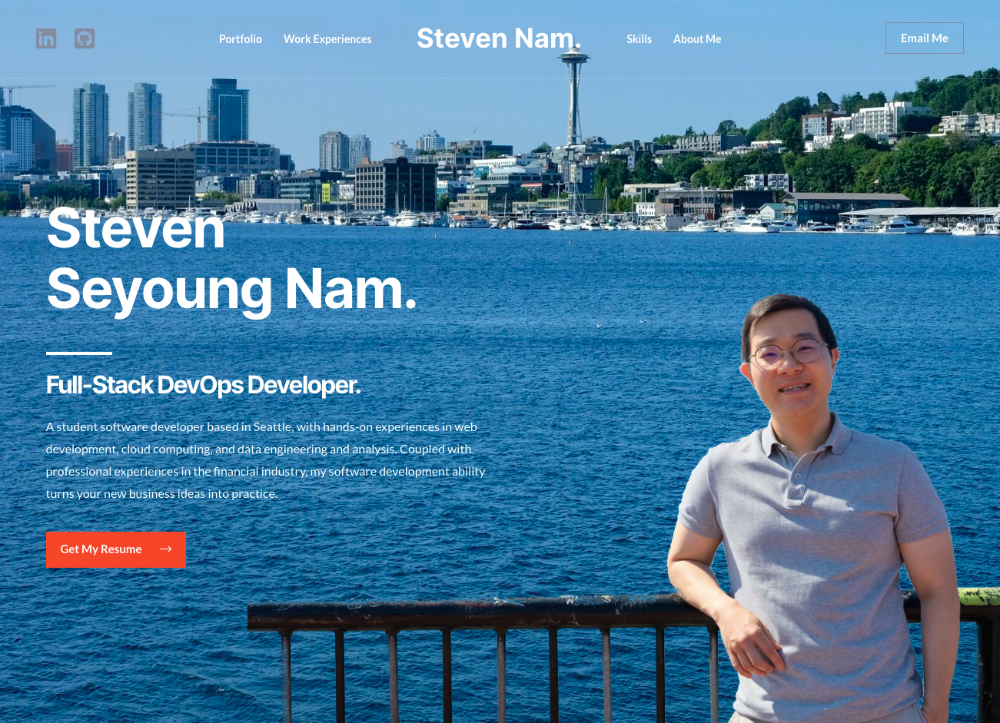

<!-- PROJECT LOGO -->
<br />
<p align="center">
  <a href="https://github.com/seyoungnam/resume_website_with_wordpress">
    
  </a>

  <h3 align="center">Build Your Resume Website with WordPress</h3>

  <p align="center">
    Build your website without coding and make your skills and experience more visible!
    <br />
    <a href="https://github.com/seyoungnam/resume_website_with_wordpress"><strong>Explore the docs »</strong></a>
    <br />
    <br />
    <a href="https://https://smartandsecurecomputing.org/stevennam/">View Demo</a>
    ·
    <a href="https://github.com/seyoungnam/resume_website_with_wordpress/issues">Report Bug</a>
    ·
    <a href="https://github.com/seyoungnam/resume_website_with_wordpress/issues">Request Feature</a>
  </p>
</p>


<!-- TABLE OF CONTENTS -->
<details open="open">
  <summary>Table of Contents</summary>
  <ol>
    <li>
      <a href="#about-the-project">About The Project</a>
    </li>
    <li>
      <a href="#getting-started">Getting Started</a>
      <ul>
        <li><a href="#prerequisites">Prerequisites</a></li>
      </ul>
    </li>
    <li><a href="#template-selection">Template Selection</a></li>
    <li>
        <a href="#designing">Designing</a>
        <ul>
        <li><a href="#main-section">Main Section</a></li>
        <li><a href="#portfolio">Portfolio</a></li>
        <li><a href="#work-experiences-and-skills">Work Experiences And Skills</a></li>
        <li><a href="#about-me">About Me</a></li>
        <li><a href="#navbar">Navbar</a></li>
        <li><a href="#footer">Footer</a></li>
      </ul>
    </li>
    <li><a href="#contributors">Contributors</a></li>
    <li><a href="#contact">Contact</a></li>
  </ol>
</details>


<!-- ABOUT THE PROJECT -->
## About The Project

  <a href="https://smartandsecurecomputing.org/stevennam/">
    
  </a>

<br>

Finding a job is a long and arduous journey. It is especially true to international students like me, who are lack of knowledge in the current job market and ignorant of how to begin the process. Most students usually start it by creating and editing their LinkedIn profile. In my opinion, the LinkedIn profile helps you get connected with potential employers, but can't give an impact so that they could remember you among thousands of applicants. I believe the resume website would play more roles than LinkedIn and that's why I built my resume website using WordPress. Below are some advantages of having a resume website.

Advantages of having a resume website:
* When someone finds you, they'll have an instant, visual representation of who you are.
* Your resume website can act as a digital portfolio of your online work and identity.
* Your website makes your skills and experience more visible among other applicants.😎

Prior to building my resume website, I did not have any experience with WordPress. But I was still able to build it within a day because of WordPress's intuitive user interface. With this tutorial, I bet you can make yours even in a shorter period of time. I hope this materials would help you create an awesome website and land on the job you are dreamed of in the end.


<!-- GETTING STARTED -->
## Getting Started

To set up the working environment, please watch and follow <a href="https://www.youtube.com/watch?v=VnjeR-bsRM4" target="_blank">Tyler's YouTube video</a> by 21:20. It will teach you every basic technic you need to implement.

### Prerequisites

There are no explicit prerequisites for this project. One thing to keep in mind is that you have to buy your domain name and a web hosting service, which will cause you to pay some amount of money. In the Tyler's video, he has decided to use <a href="https://hostgator.com" target="_blank">HostGator</a> for the web hosting. Although you don't necessarily follow his recommendation, you better stick to it because this tutorial is written based on the HostGator's WordPress configuration.


<!-- Template Selection -->
## Template Selection

1. Clean all Plugins out.

    

    

<br>

2. Visit your site to confirm your site is empty.

    

<br>

3. Back into the dashboard and go to “**Settings**” and “**Permalinks**”. Make sure to choose “**Post name**” as the URL and click “**save changes**”.

    

    

<br>

4. To make sure your website is discoverable by the search engines. Go to “**Reading**” in the settings, make sure “**Search engine visibility**” part is not checked. And click “**save changes**”.

    

<br>

5. Install the theme. 

    * Go to “**Appearance**” and click on “**Themes**”.
    
    * Click “**Add New**” button.
    
    * In the search bar, type “Astra”, and click on **install**, and **activate** on Astra theme.
    

<br>

6. Install plugins for template.

    1. Click “**Plugins**” -> “**Add New**” -> type “**Starter templates**” in search bar, then click “**Install**” and “**activate**” on Starter Templates - Elementor.
    
    
    2. Click “**Apperance**” -> “**Starter Templates**”. Choose Elementor.
    
    
    3. In the search box, type and click “**Learn Digital Marketing**”.
    
    4. Click “**Import Complete Site**”.
    
    5. Also make sure to install “**Premium Addons for Elementor**” (Plugins -> Add New -> Search "premium addons for elementor" -> Install Now & Activate)
    

<br>


<!-- Designing -->
## Designing

### Main Section

1. Visit your site and activate the Elementor editor by clicking "**Edit with Elementor**" on the top bar.


2. Create a new section: From your left pane, find “**Inner Section**”. Drag it under the red button.


3. My name: Duplicate the heading “My name is Ben Arthur. Digital marketing expert.” and drag it down to the left blank section. Change the contents in the editor(left pane) to the following directions.
    * Content -> Title: "Your Name"
    * Content -> Alignment: left
    * Advanced -> Padding: 0 0 0 0
    

4. A White bar: Click the nine dots on top-right corner of the editor and choose “divider”. Drag it down to your name.

    * Content -> Width: 86 PX
    * Style -> Color #FFFFFF/Weight 4/Gap 0
    * Advanced -> Padding: 24 0 0 0


5. A job position: Duplicate your name section. Drag it down under the white bar.
    * Content -> Title: "a position you are looking for"
    * Content -> HTML Tag: H3

6. A short introduction: Duplicate the paragraph from the given template. Drag it down under the white bar.
    * Content -> Text Editor: "your introduction"
    * Style
        - Alignment: Left
        - Text Color: #FFFFFF
    * Advanced -> Padding: 0 0 0 0


7. Red button: Duplicate the red button from the given template. Place it under your short introduction.
    * Content -> Button -> Text: Get My Resume
    * Content -> Link: paste the link that holds your resume
    * Content -> Link -> Alignment: left

       
8. Background: Click the vacant dark background, then you can find the six dots on top of the section. Click the six dot button.
    
    * Style -> Background -> Normal
        - Image: choose your main background image
        - Position: Custom
        - Y Position: -488 PX
        - Attachment: Fixed
        - Repeat: No-repeat
        - Size: Auto

    * Style -> Background Overlay
        - Image: choose your face image with the transparent background
        - Position: Bottom-right
        - Repeat: No-repeat
        - Size: Custom / Width: 75 %
        - Background Overlay -> Normal -> Opacity: 1
        - Background Overlay -> Normal -> Color: Clear("go back" button)

9. Wrap up: Remove unnecessary contents and click the update button on the bottom left.


<br>

### Portfolio

1. Delete the section containing “I have been more than 12 years in digital marketing ~ “.

2. Go down to the "Digital Marketing Resource" section. Grap and drag the entire section right under the main section.


3. Change the background and contents. Remove unncessary contents.
    1. Click the section button on the top left and remove the current image.
        
        * Style -> Background -> Normal -> Color: #F4F5F6
        * Style -> Background Overlay -> Color: Clear ("go back" button)
        * Advanced -> Padding: 100 0 50 0

    2. Change the text in the title and paragraph.
        * For title, Style -> Title -> Text Color: #020101
        * For paragraph, Style -> Title -> Text Color: #7A7A7A

    3. Delete the "View All Resources" button.

4. Create the card section.
    1. Click the "**add section**" button, select the plus button, and choose the four section.
    
    
    

    2. Align the background color. To do so, Click the six dot button.
        * Style -> Background
            - Background Type: Classic (the first button)
            - Color: #F4F5F6

    3. Establish a column style: click one column out of four.
    
        * Style -> Background -> Normal
            - Background Type: Classic
            - Color: #FFFFFF
        * Style -> Border
            - Normal -> Radius 15 15 15 15
            - Hover -> Radius 15 15 15 15 / Box Shadow blur 10
        * Advanced -> Margin: 20 20 20 20
        
    4. Insert the modal box: click the nine dot button, search "premium modal box", and drag the box to the column. You will see that the column style is well applied when your cursor hovers over the card.
    
    

    5. Insert the image box: click the nine dot button, search "image box", and drag the box to the column.
    

    6. Edit the image box
        * Delete the image.
        * Content
            - Image Box -> Title & Description: "Your project title and description"
            - Title HTML Tag: H5
        * Style -> Content
            - Alignment: left
            - Spacing: 0
            - Description -> Typography: 15 PX
        * Advacned -> Padding: 10 10 10 10
        

    7. Edit the modal box
        * Click the pencil button of the premium modal box.
        * Content -> Content
            - Title: "Your project title"
            - Content -> Text: Put Your project introduction text and link using a tag.
            - Lower Close Button: No
            - Entrance Animation: Fade In
        * Content -> Trigger Options
            - Trigger: Image
            - Image: "Your project thumbnail"
            - Alignment: Center
        

    8. By applying the same strategy, create other portfolio cards. Don't forget to give 100 padding at the bottom.
    

<br>

### Work Experiences And Skills

1. Drag the "My Experience" section right under the portfolio section. Change the title to "Work Expriences & Skills". Delete the texts under the title.

2. Change the background color to white.


3. Skill Category Title: Insert the "Text Editor" block under the title.
    * Content -> Text Editor
        - Change "Paragraph" to "Heading 5"
        - Type in one of your skills in the text box
    * Advanced -> Margin: 0 0 -16 0

4. Relevant Skills: Insert the "Text Editor" block under the skill title. 
    * Content -> Text Editor -> Text: Create your contents using HTML tags. Feel free to use my format as follows.
    

```HTML
<div class="row">
    <div class="alignleft" style="text-align: justify; -moz-text-align-last: center; text-align-last: center;">

        

        NodeJs

    </div>

    <div class="alignleft" style="text-align: justify; -moz-text-align-last: center; text-align-last: center;">

        

        Django

    </div>
    <div class="alignleft" style="text-align: justify; -moz-text-align-last: center; text-align-last: center;">

        

        React

    </div>
    <div class="alignleft" style="text-align: justify; -moz-text-align-last: center; text-align-last: center;">

        

        FastAPI

    </div>
</div>
```


5. Repeat Step 3 and 4 if necessary, to fully showcase your skill set.

6. For your experience part, expand the section width first. Hover your cursor to the section border, grap the section border, and adjust the width.


7. Pull the work experiences section to the left.
    1. Select the work experiences section.
    2. Advanced -> Padding: 50 0 0 0
    

8. Edit the contents of each expereince. Make sure to add Heading between your job title and task descriptions.

    * For the organization you worked for, Content -> Title -> HTML Tag: H5

<br>

### About Me

1. We are going to use the given "About Me" template. First of all, change the background color.
    * Style -> Background -> Normal -> Color: #F4F5F6

2. Subsititue the original image with "Image Carousel".

    * Content -> Image Carousel
        - "add button" : Choose multiple images.
        - Image Size: Full
        - Slides to Show: 1
        - Image Stretch: No
        - Navigation: Arrows and Dots

3. Change the contents of the two paragraphs below the title - "About Me".

4. Delete "Read More" button and the following numeric information.

5. Add "Education" section.
    1. Grap and drop the "Heading" element below the paragraph in the right column.
    
        * Content -> Title: Education
        * Content -> HTML Tag: H3
        * Advanced -> Padding: 30 0 15 0

    2. Similar to the above step, add "Text Editor" below "Education".
        * Content -> Text Editor -> Text (not "Visual")
        ```HTML
        <div class="row">
            <div class="alignleft"></div>
            <div class="alignleft">
            <h5 style="font-style: normal; margin-bottom: 4px;">M.S. in Information Management</h5>
            University of Washington - Seattle, WA, Jun 2022

        </div>
        </div>
        ```

    3. Repeat the step 2 if you need to add an additional degree.

6. To add "Certifications" section, iterate step 5.

7. Remove unnecessary contents under the "About Me" section. Push "Update" button.

<br>

### Navbar

1. To make sure that the website moves down to "Portfolio" section when clicking "Portfolio" button in the navbar, search for a "Menu Anchor" widget element, drag and drop it above the "Portfolio" title.

    * Content -> Anchor -> The ID of Menu Anchor: portfolio

2. Create the anchor for "Work Experiences", "Skills", and "About Me" by iterating step 1. Make sure to assign their own anchor ID.

3. Push "Update" button and get out of the editing mode by re-entering your website address.

4. Click "Customize" button on the top black bar.


5. Once clicking the pencil icon on the top right corner, you can identify each component's name and its location.


6. Edit "Social" icons.
    1. Click the "Social" component in the bar. The editor on your left pane will change. 
    
    
    2. You can add or remove your social networking sites. Make sure to attach the URL.
    

7.  Edit "Site Identity & Logo".
    1. Click the "Site Identity & Logo" in the bar.

    2. You can substitue the current logo with yours by clicking "Change Logo" button on your left pane. If you don't have any logos, turn on "Display Site Title" and write your name.
    

    3. click "Design" in the editor and choose the following colors.
        - Title Color -> Normal: #ffffff
        - Title Color -> Hover: (r,g,b,a) : (0 0 0 0.68)

8. Edit "Button".
    1. Click the "Button" in the bar.
    2. Text: "Email Me"
    3. Link: mailto:"your email address"
    4. Activate "Open in a New Tab".

9. Edit "Primary Menu" and "Secondary Menu".
    1. Click the "previous" button until it disappears in your editor.
    
    2. Menus -> Primary
    3. Remove all existing menus(Home, About, Courses).
    
    4. Hit "Add Items" and open "Custom Links".
        - URL: "#" + "anchor ID"
        (e.g. #portfolio)
        - Link Text: "Button name"
        (e.g. Portfolio)
        - Hit "Add to Menu"
        

    5. Repeat from step 2 to 4. Make sure to choose "Secondary" in step 2.

<br>

### Footer

1. Scroll down to the bottom of the site, click the pencil icon on the top right corner to show up the control bar.


2. Remove all cards except the "Copyright" card.


3. Click the "Copyright" card in the control bar. Edit the contents of the paragraph in the editor.
(e.g. [copyright] [current_year] [site_title] | Powered by WordPress)


<br>

<!-- CONTRIBUTORS -->
## Contributors

* Steven Seyoung Nam: [Github] (https://github.com/seyoungnam/)
* Cathy Lee: [Github] (https://github.com/cathylee12)
* Kimyou By
* Valerie Kim

Special Thanks to [KSEA Seattle chapter] (https://seattle.ksea.org) and [Smart And Secure Computing Research Group] (https://smartandsecurecomputing.org/)!! 👍 🎉 🥳

<!-- CONTACT -->
## Contact

Your Name - [Steven Seyoung Nam](https://www.linkedin.com/in/seyoungnam/) - seyoung.nam@gmail.com

Project Link: [https://smartandsecurecomputing.org/stevennam/](https://smartandsecurecomputing.org/stevennam/)


